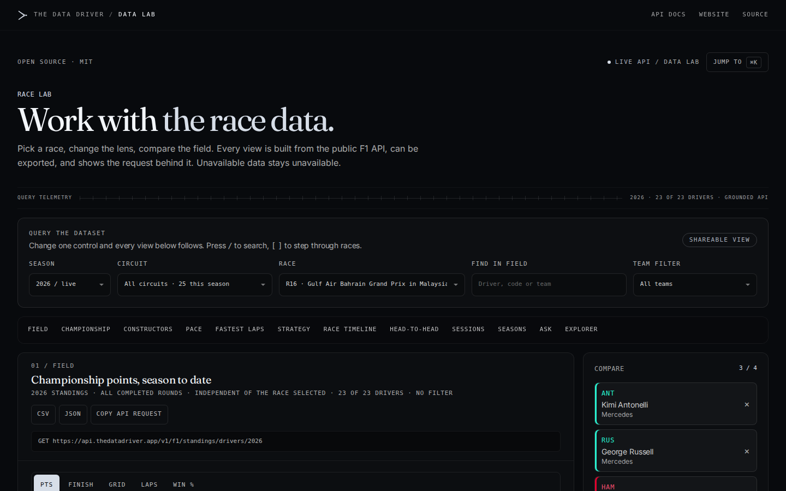
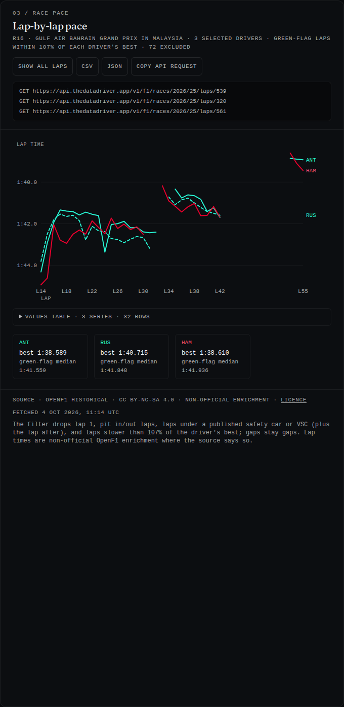
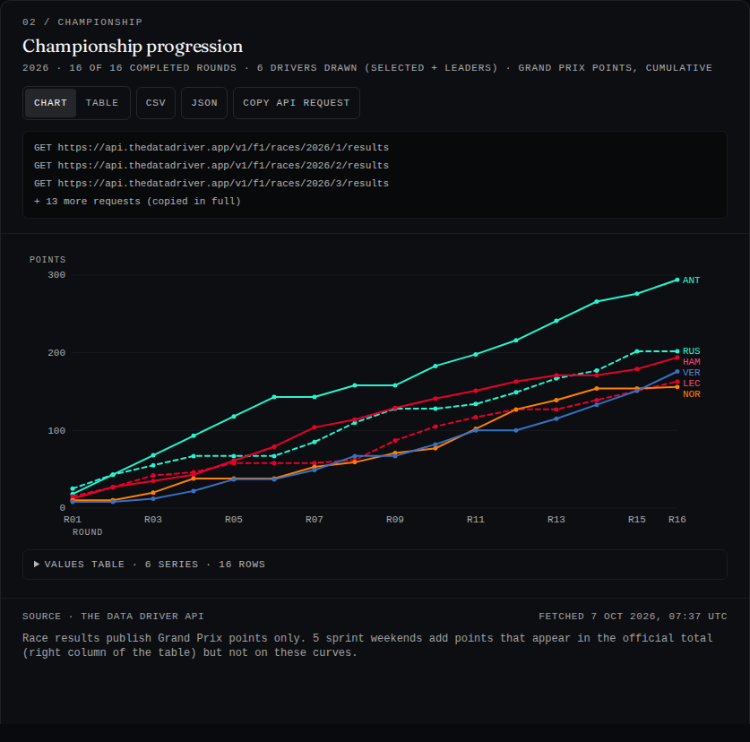
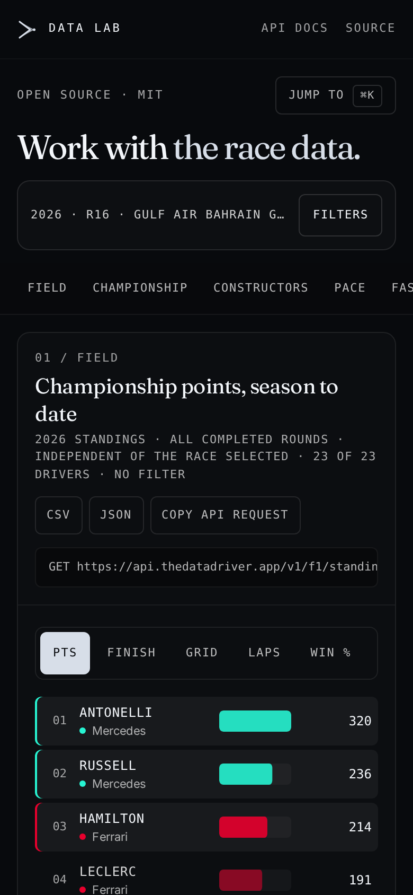

# The Data Driver — Data Lab

**Explore, compare and export Formula 1 data in your browser.** The Data Lab is the open-source
analysis workspace of [The Data Driver](https://thedatadriver.app/lab): pick a race, change the lens,
compare the field. Every view is built from a public API, can be exported, and shows the request behind it.
Unavailable data stays unavailable — nothing is guessed or back-filled.

[](https://github.com/thejoyfulist/the-data-driver-lab/actions/workflows/ci.yml)
[](LICENSE)
[](#data-licences)

[](https://vercel.com/new/clone?repository-url=https%3A%2F%2Fgithub.com%2Fthejoyfulist%2Fthe-data-driver-lab&project-name=the-data-driver-lab&repository-name=the-data-driver-lab)



| Lap-by-lap pace | Championship progression |
| --- | --- |
|  |  |

<sub>Screenshots taken against the live public API. Lap times shown in them are non-official OpenF1 enrichment (CC BY-NC-SA 4.0), attributed in the view itself.</sub>

## Features

- **Twelve linked views** driven by one set of controls (season, circuit, race, drivers, team):
  field, championship progression, constructors, lap-by-lap pace, fastest laps, pit stops and stints,
  safety cars / incidents / weather timeline, driver head-to-head, practice and qualifying sessions,
  season comparison, grounded questions, and a free data explorer.
- **Every number has a source.** Each view shows its `GET` request, its provenance (official results or
  attributed OpenF1 enrichment) and its fetch time. One click copies the request.
- **Exports**: CSV and JSON for every view.
- **Shareable state**: the URL carries the season, round and selection.
- **Keyboard first**: `⌘K` / `Ctrl+K` command palette, `/` to search the field, `[` `]` to step through races.
- **Works without JavaScript** for the default race: the server renders the main tables; charts are
  progressive enhancement.
- **Honest empty states**: when an endpoint is unavailable the view says so; it never substitutes a prediction
  for a measured result.
- **Mobile layout** with compact filters.



## Quick start

Requirements: Node.js 20.9 or later (22 LTS recommended) and npm.

```bash
git clone https://github.com/thejoyfulist/the-data-driver-lab.git
cd the-data-driver-lab
npm install
npm run dev
```

Open <http://localhost:3000>. The Lab reads the public API at `https://api.thedatadriver.app` by default;
no key or account is needed.

With Docker:

```bash
docker compose up --build
```

More options (production build, Docker without Compose, Vercel, environment variables) are in
[docs/INSTALL.md](docs/INSTALL.md).

## Configuration

| Variable | Read at | Default | Purpose |
| --- | --- | --- | --- |
| `TDD_API_BASE` | runtime (server) | `https://api.thedatadriver.app` | Upstream API used by the server page and the `/api/f1` proxy. |
| `NEXT_PUBLIC_TDD_API_BASE` | build time | `https://api.thedatadriver.app` | Origin shown in "copy API request" and allowed by the CSP. Also used by the server when `TDD_API_BASE` is unset. |
| `NEXT_PUBLIC_TDD_REPO_URL` | build time | this repository | "Source" link in the header and footer. |

Copy `.env.example` to `.env.local` to override them locally.

## Architecture

```
Browser ──► Next.js app (this repository)
              ├─ /            Server component: fetches the default race, renders it (ISR, 5 min)
              │               then hydrates the client Lab (React 19)
              └─ /api/f1/...  Same-origin proxy with a path allow-list ──► TDD_API_BASE/v1/f1/...
```

- `src/app/page.tsx` — server entry: calendar, standings, the last completed race and its views' seed.
- `src/app/LabPageClient.tsx` — controls, URL state, field, sessions, explorer and grounded questions.
- `src/components/lab/` — the analytical views (`LabViews`, `SeasonViews`), charts (SVG, no chart library),
  lazy loading, command palette and the shared resource cache (`useLabResource`).
- `src/lib/lab-client.ts` — typed, all-optional payload shapes, the browser fetch helper and exports.
- `src/lib/lab-analytics.ts` — pure functions (green-flag pace filter, stints, championship progression…).
- `src/lib/proxy-allowlist.mjs` — the read endpoints the proxy forwards; everything else answers 404.
- `src/lib/team-colors.ts` — team colours as plain hex values (no logos or other team assets).

The browser only talks to its own origin. The proxy forwards the allow-listed `GET` endpoints and a single
`POST` (`/v1/f1/chat`, the grounded question endpoint) with an 8 KB body limit.

## Development

```bash
npm run lint        # ESLint (eslint-config-next)
npm run typecheck   # tsc --noEmit
npm test            # unit tests (node:test)
npm run test:e2e    # Playwright against a local mock API (npx playwright install chromium first)
npm run build       # production build
```

See [CONTRIBUTING.md](CONTRIBUTING.md) before opening a pull request.

## Data licences

**The code in this repository is MIT-licensed. The data it displays is not**: it stays under the licence of
its source, and anything you build or publish with it must respect those terms.

| Data | Source | Terms |
| --- | --- | --- |
| Results, qualifying, standings, calendar | [formula1.com](https://www.formula1.com), projected by The Data Driver API | Official classifications, used with attribution. Check formula1.com's terms before any reuse beyond personal analysis. |
| Laps, stints, pit stops, weather, race control, telemetry | [OpenF1](https://openf1.org) historical API, via The Data Driver API | [CC BY-NC-SA 4.0](https://creativecommons.org/licenses/by-nc-sa/4.0/): **non-commercial use only, attribution required, adaptations shared under the same licence.** The API marks every such payload (`meta.license`, `meta.attribution`) and the Lab labels it as non-official enrichment. |
| Forecasts | The Data Driver model | Published for non-commercial use; see the [methodology](https://thedatadriver.app/methodology). |

The Data Driver API is free and non-commercial; rate limits apply. Please do not use this application to
scrape it — use the API directly and cache responsibly (see [docs/API.md](docs/API.md)).

### Not affiliated with Formula 1

This project is unofficial and is not associated in any way with the Formula 1 companies. F1, FORMULA ONE,
FORMULA 1, FIA FORMULA ONE WORLD CHAMPIONSHIP, GRAND PRIX and related marks are trade marks of Formula One
Licensing B.V. Team and driver names are used only to identify the data. The repository contains no team
logos, driver photographs or other third-party assets: teams are identified by a colour swatch.

The bundled fonts (Fraunces, Inter) are distributed under the SIL Open Font License 1.1 (`public/fonts/OFL-*.txt`).
The Data Driver name and logo mark identify the original project; please do not present a fork as the
official The Data Driver site.

## Licence

[MIT](LICENSE) for the code. Data: see [Data licences](#data-licences).
